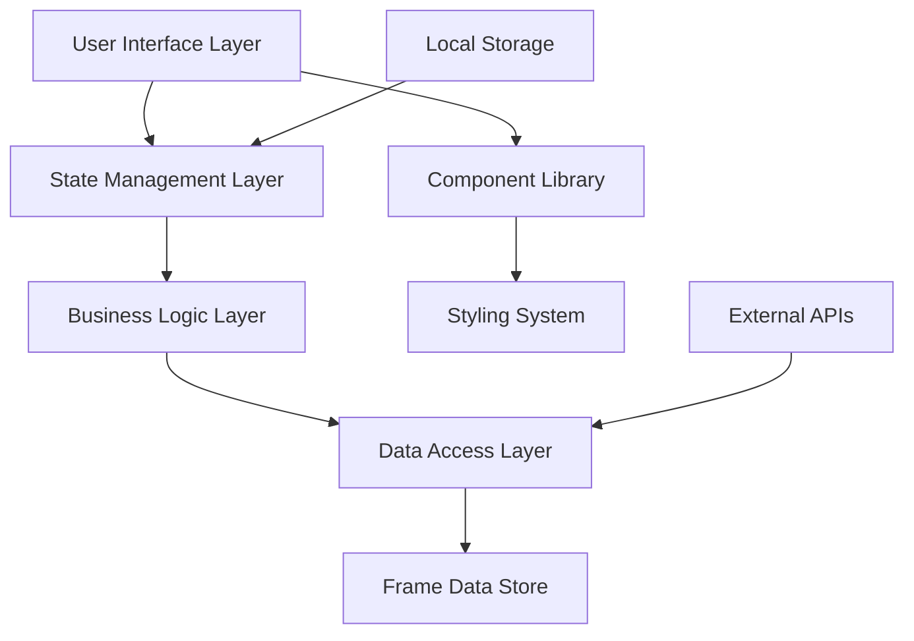

# Design Document

## Overview

The Smash Revenger application will be built as a modern, responsive web application using React with TypeScript. The architecture follows a component-based design with clear separation of concerns between data management, business logic, and presentation layers. The application will be optimized for performance with client-side calculations and efficient state management.

## Architecture

### High-Level Architecture



### Technology Stack

- **Frontend Framework**: React 18 with TypeScript
- **Build Tool**: Vite for fast development and optimized builds
- **Styling**: Tailwind CSS for utility-first styling
- **State Management**: Zustand for lightweight, performant state management
- **Data Storage**: JSON files for frame data with potential IndexedDB caching
- **Testing**: Vitest + React Testing Library
- **Deployment**: GitHub Pages with automated CI/CD

## Components and Interfaces

### Core Components

#### 1. Application Shell (`App.tsx`)
- Main application container
- Handles global state initialization
- Manages responsive layout breakpoints

#### 2. Character Selector (`CharacterSelector.tsx`)
```typescript
interface CharacterSelectorProps {
  type: 'attacker' | 'defender';
  selectedCharacters: string[];
  onCharacterSelect: (characterId: string) => void;
  multiSelect?: boolean;
}
```

#### 3. Move Selector (`MoveSelector.tsx`)
```typescript
interface MoveSelectorProps {
  characterId: string;
  selectedMove: string | null;
  onMoveSelect: (moveId: string) => void;
  categoryFilter?: MoveCategory[];
}
```

#### 4. Calculation Engine (`CalculationEngine.tsx`)
```typescript
interface CalculationEngineProps {
  attackingMove: Move;
  defendingCharacters: Fighter[];
  options: CalculationOptions;
  onResultsCalculated: (results: PunishResult[]) => void;
}
```

#### 5. Results Display (`ResultsTable.tsx`)
```typescript
interface ResultsTableProps {
  results: PunishResult[];
  sortBy: SortOption;
  filterOptions: FilterOptions;
  onExport: (format: ExportFormat) => void;
}
```

#### 6. Options Panel (`OptionsPanel.tsx`)
```typescript
interface OptionsPanelProps {
  options: CalculationOptions;
  onOptionsChange: (options: CalculationOptions) => void;
}
```

### Layout Components

#### 1. Responsive Grid (`ResponsiveGrid.tsx`)
- Handles layout adaptation across screen sizes
- Mobile: Single column stack
- Tablet: Two-column layout
- Desktop: Three-column layout

#### 2. Modal System (`Modal.tsx`)
- Character selection modals on mobile
- Export confirmation dialogs
- Help and information overlays

## Data Models

### Core Data Structures

#### Fighter Interface
```typescript
interface Fighter {
  id: string;
  name: string;
  nameJP: string;
  series: string;
  iconUrl: string;
  moves: Move[];
  guardCancelOptions: GuardCancelOption[];
  weight: number;
  fallSpeed: number;
}
```

#### Move Interface
```typescript
interface Move {
  id: string;
  name: string;
  nameJP: string;
  input: string;
  type: MoveType;
  category: MoveCategory;
  frameData: FrameData;
  properties: MoveProperties;
}

interface FrameData {
  startup: number;
  active: number[];
  recovery: number;
  total: number;
  onShield: number;
  landingLag?: number;
}

interface MoveProperties {
  damage: number;
  range: Range;
  killPower: number;
  priority: number;
  hitboxes: Hitbox[];
}
```

#### Calculation Result Interface
```typescript
interface PunishResult {
  defendingCharacter: Fighter;
  punishMove: Move;
  frameAdvantage: number;
  method: PunishMethod;
  guaranteed: boolean;
  notes?: string;
}

type PunishMethod = 'normal' | 'jump_cancel' | 'up_b_cancel' | 'up_smash_cancel';
```

#### Application State Interface
```typescript
interface AppState {
  // Character Selection
  attackingCharacter: Fighter | null;
  defendingCharacters: Fighter[];
  selectedMove: Move | null;
  
  // Calculation Options
  calculationOptions: CalculationOptions;
  
  // Results
  currentResults: PunishResult[];
  isCalculating: boolean;
  
  // UI State
  activeTab: TabType;
  mobileMenuOpen: boolean;
  selectedResultIndex: number;
}

interface CalculationOptions {
  considerStaling: boolean;
  rangeFilter: Range[];
  includeGuardCancel: boolean;
  minimumAdvantage: number;
  showOnlyGuaranteed: boolean;
}
```

## Business Logic

### Frame Calculation Engine

#### Core Calculation Logic
```typescript
class FrameCalculator {
  static calculatePunishWindow(
    attackMove: Move,
    defendMove: Move,
    method: PunishMethod,
    options: CalculationOptions
  ): PunishResult {
    const shieldAdvantage = this.getShieldAdvantage(attackMove, options);
    const methodFrameCost = this.getMethodFrameCost(method);
    const totalAdvantage = shieldAdvantage - methodFrameCost;
    
    return {
      frameAdvantage: totalAdvantage,
      guaranteed: totalAdvantage >= defendMove.frameData.startup,
      method,
      // ... other properties
    };
  }
  
  private static getShieldAdvantage(move: Move, options: CalculationOptions): number {
    let advantage = Math.abs(move.frameData.onShield);
    
    if (options.considerStaling) {
      advantage = this.applyStalingModifier(advantage, move);
    }
    
    return advantage;
  }
  
  private static getMethodFrameCost(method: PunishMethod): number {
    const frameCosts = {
      normal: 11, // Shield drop
      jump_cancel: 3,
      up_b_cancel: 8,
      up_smash_cancel: 11
    };
    
    return frameCosts[method];
  }
}
```

### Data Management

#### Frame Data Service
```typescript
class FrameDataService {
  private static instance: FrameDataService;
  private fightersCache: Map<string, Fighter> = new Map();
  
  async loadFighterData(fighterId: string): Promise<Fighter> {
    if (this.fightersCache.has(fighterId)) {
      return this.fightersCache.get(fighterId)!;
    }
    
    const data = await import(`../data/fighters/${fighterId}.json`);
    const fighter = this.validateAndTransformFighterData(data);
    this.fightersCache.set(fighterId, fighter);
    
    return fighter;
  }
  
  async getAllFighters(): Promise<Fighter[]> {
    const fighterIds = await this.getFighterIds();
    return Promise.all(fighterIds.map(id => this.loadFighterData(id)));
  }
}
```

## Error Handling

### Error Boundaries
- Global error boundary for unhandled exceptions
- Component-level error boundaries for graceful degradation
- Network error handling with retry mechanisms

### Validation Layer
```typescript
class DataValidator {
  static validateFighterData(data: unknown): Fighter {
    // Runtime validation using Zod or similar
    return fighterSchema.parse(data);
  }
  
  static validateMoveData(data: unknown): Move {
    return moveSchema.parse(data);
  }
}
```

### User Feedback
- Loading states for all async operations
- Clear error messages for user-facing issues
- Fallback UI for missing or corrupted data

## Testing Strategy

### Unit Testing
- **Frame Calculator**: Test all calculation scenarios including edge cases
- **Data Validation**: Ensure data integrity and proper error handling
- **State Management**: Test state transitions and side effects
- **Utility Functions**: Test helper functions and data transformations

### Integration Testing
- **Component Integration**: Test component interactions and data flow
- **API Integration**: Test data loading and caching mechanisms
- **State Integration**: Test complex state changes across components

### End-to-End Testing
- **User Workflows**: Test complete user journeys from selection to results
- **Responsive Behavior**: Test layout adaptation across screen sizes
- **Performance**: Test loading times and calculation performance

### Accessibility Testing
- **Keyboard Navigation**: Ensure full keyboard accessibility
- **Screen Reader**: Test with screen reader software
- **Color Contrast**: Automated testing for WCAG compliance
- **Focus Management**: Test focus handling in dynamic content

## Performance Optimization

### Data Loading Strategy
- **Lazy Loading**: Load fighter data on demand
- **Code Splitting**: Split components by route and feature
- **Caching**: Implement intelligent caching for frequently accessed data
- **Compression**: Use gzip compression for data files

### Calculation Optimization
- **Memoization**: Cache calculation results for repeated queries
- **Web Workers**: Offload heavy calculations to prevent UI blocking
- **Debouncing**: Debounce user input to reduce unnecessary calculations

### Rendering Optimization
- **Virtual Scrolling**: For large result sets
- **React.memo**: Prevent unnecessary re-renders
- **Lazy Components**: Load components only when needed

## Security Considerations

### Data Integrity
- **Input Validation**: Validate all user inputs and data sources
- **XSS Prevention**: Sanitize any dynamic content
- **CSP Headers**: Implement Content Security Policy

### Privacy
- **Local Storage**: Minimize data stored locally
- **No Tracking**: Avoid unnecessary user tracking
- **Data Minimization**: Only collect and process necessary data

## Deployment and Infrastructure

### Build Process
```yaml
# GitHub Actions workflow
name: Build and Deploy
on:
  push:
    branches: [main]
jobs:
  build-and-deploy:
    runs-on: ubuntu-latest
    steps:
      - uses: actions/checkout@v3
      - uses: actions/setup-node@v3
      - run: npm ci
      - run: npm run build
      - run: npm run test
      - uses: peaceiris/actions-gh-pages@v3
```

### Performance Monitoring
- **Core Web Vitals**: Monitor LCP, FID, CLS
- **Bundle Analysis**: Regular bundle size monitoring
- **Error Tracking**: Client-side error reporting

### Progressive Enhancement
- **Service Worker**: Cache static assets and data
- **Offline Support**: Basic functionality without network
- **PWA Features**: App-like experience on mobile devices