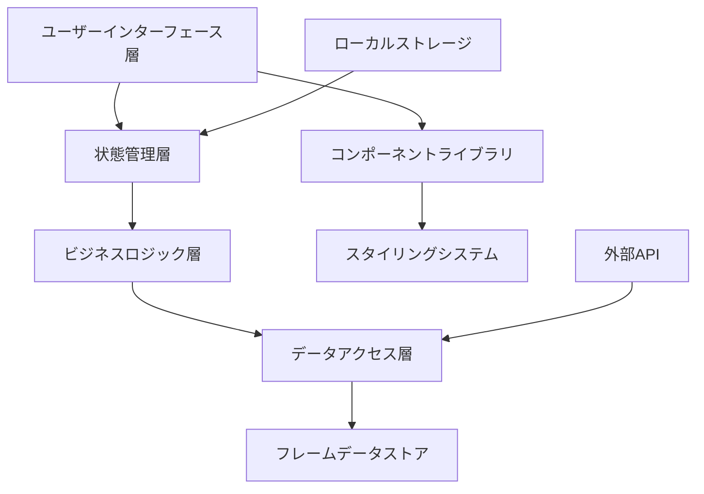

# 設計書

## 概要

LagScopeアプリケーションは、React with TypeScriptを使用したモダンで、レスポンシブなWebアプリケーションとして構築されます。アーキテクチャはコンポーネントベースの設計に従い、データ管理、ビジネスロジック、プレゼンテーション層間の明確な関心の分離を実現します。アプリケーションは、クライアントサイドの計算と効率的な状態管理でパフォーマンスを最適化します。

## アーキテクチャ

### 高レベルアーキテクチャ



### 技術スタック

- **フロントエンドフレームワーク**: React 18 with TypeScript
- **ビルドツール**: Vite（高速開発と最適化されたビルドのため）
- **スタイリング**: Tailwind CSS（ユーティリティファーストスタイリングのため）
- **状態管理**: Zustand（軽量で高性能な状態管理のため）
- **データストレージ**: フレームデータ用JSONファイル（IndexedDBキャッシュの可能性あり）
- **テスト**: Vitest + React Testing Library
- **デプロイ**: GitHub Pages（自動化されたCI/CDと共に）

## コンポーネントとインターフェース

### コアコンポーネント

#### 1. アプリケーションシェル (`App.tsx`)
- メインアプリケーションコンテナ
- グローバル状態の初期化を処理
- レスポンシブレイアウトブレークポイントの管理

#### 2. キャラクターセレクタ (`CharacterSelector.tsx`)
```typescript
interface CharacterSelectorProps {
  type: 'attacker' | 'defender';
  selectedCharacters: string[];
  onCharacterSelect: (characterId: string) => void;
  multiSelect?: boolean;
}
```

#### 3. 技セレクタ (`MoveSelector.tsx`)
```typescript
interface MoveSelectorProps {
  characterId: string;
  selectedMove: string | null;
  onMoveSelect: (moveId: string) => void;
  categoryFilter?: MoveCategory[];
}
```

#### 4. 計算エンジン (`CalculationEngine.tsx`)
```typescript
interface CalculationEngineProps {
  attackingMove: Move;
  defendingCharacters: Fighter[];
  options: CalculationOptions;
  onResultsCalculated: (results: PunishResult[]) => void;
}
```

#### 5. 結果表示 (`ResultsTable.tsx`)
```typescript
interface ResultsTableProps {
  results: PunishResult[];
  sortBy: SortOption;
  filterOptions: FilterOptions;
  onExport: (format: ExportFormat) => void;
}
```

#### 6. オプションパネル (`OptionsPanel.tsx`)
```typescript
interface OptionsPanelProps {
  options: CalculationOptions;
  onOptionsChange: (options: CalculationOptions) => void;
}
```

### レイアウトコンポーネント

#### 1. レスポンシブグリッド (`ResponsiveGrid.tsx`)
- 画面サイズ間でのレイアウト適応を処理
- モバイル: 単一列スタック
- タブレット: 2列レイアウト
- デスクトップ: 3列レイアウト

#### 2. モーダルシステム (`Modal.tsx`)
- モバイルでのキャラクター選択モーダル
- エクスポート確認ダイアログ
- ヘルプと情報オーバーレイ

## データモデル

### コアデータ構造

#### ファイターインターフェース
```typescript
interface Fighter {
  id: string;
  name: string;
  nameJP: string;
  series: string;
  iconUrl: string;
  moves: Move[];
  guardCancelOptions: GuardCancelOption[];
  weight: number;
  fallSpeed: number;
}
```

#### GuardCancelOptionインターフェース
```typescript
interface GuardCancelOption {
  type: 'jump' | 'upB' | 'upSmash';
  move: Move;
  totalFrames: number; // ガードキャンセルのベースフレーム + 技の発生フレーム
}
```

#### 技インターフェース
```typescript
interface Move {
  id: string;
  name: string;
  nameJP: string;
  input: string;
  type: MoveType;
  category: MoveCategory;
  frameData: FrameData;
  properties: MoveProperties;
}

interface FrameData {
  startup: number;
  active: number[];
  recovery: number;
  total: number;
  onShield: number;
  landingLag?: number;
}

interface MoveProperties {
  damage: number;
  range: Range;
  killPower: number;
  priority: number;
  hitboxes: Hitbox[];
}
```

#### 計算結果インターフェース
```typescript
interface PunishResult {
  defendingCharacter: Fighter;
  punishMove: Move;
  frameAdvantage: number;
  method: PunishMethod;
  guaranteed: boolean;
  notes?: string;
}

type PunishMethod = 'normal' | 'jump_cancel' | 'up_b_cancel' | 'up_smash_cancel';
```

#### アプリケーション状態インターフェース
```typescript
interface AppState {
  // キャラクター選択
  attackingCharacter: Fighter | null;
  defendingCharacters: Fighter[];
  selectedMove: Move | null;
  
  // 計算オプション
  calculationOptions: CalculationOptions;
  
  // 結果
  currentResults: PunishResult[];
  isCalculating: boolean;
  
  // UI状態
  activeTab: TabType;
  mobileMenuOpen: boolean;
  selectedResultIndex: number;
}

interface CalculationOptions {
  considerStaling: boolean;
  rangeFilter: Range[];
  includeGuardCancel: boolean;
  minimumAdvantage: number;
  showOnlyGuaranteed: boolean;
}
```

## ビジネスロジック

### フレーム計算エンジン

#### コア計算ロジック
```typescript
class FrameCalculator {
  static calculatePunishWindow(
    attackMove: Move,
    defendMove: Move,
    method: PunishMethod,
    options: CalculationOptions
  ): PunishResult {
    const shieldAdvantage = this.getShieldAdvantage(attackMove, options);
    const methodFrameCost = this.getMethodFrameCost(method);
    const totalAdvantage = shieldAdvantage - methodFrameCost;
    
    return {
      frameAdvantage: totalAdvantage,
      guaranteed: totalAdvantage >= defendMove.frameData.startup,
      method,
      // ... その他のプロパティ
    };
  }
  
  private static getShieldAdvantage(move: Move, options: CalculationOptions): number {
    let advantage = Math.abs(move.frameData.onShield);
    
    if (options.considerStaling) {
      advantage = this.applyStalingModifier(advantage, move);
    }
    
    return advantage;
  }
  
  private static getMethodFrameCost(method: PunishMethod): number {
    const frameCosts = {
      normal: 11, // シールド解除
      jump_cancel: 3, // ジャンプ踏み切りのみ（空中攻撃の発生Fは別途加算）
      up_b_cancel: 0, // キャラクター固有の上B発生Fをそのまま使用
      up_smash_cancel: 0 // キャラクター固有の上スマ発生Fをそのまま使用
    };
    
    return frameCosts[method];
  }
}
```

### データ管理

#### フレームデータサービス
```typescript
class FrameDataService {
  private static instance: FrameDataService;
  private fightersCache: Map<string, Fighter> = new Map();
  
  async loadFighterData(fighterId: string): Promise<Fighter> {
    if (this.fightersCache.has(fighterId)) {
      return this.fightersCache.get(fighterId)!;
    }
    
    const data = await import(`../data/fighters/${fighterId}.json`);
    const fighter = this.validateAndTransformFighterData(data);
    this.fightersCache.set(fighterId, fighter);
    
    return fighter;
  }
  
  async getAllFighters(): Promise<Fighter[]> {
    const fighterIds = await this.getFighterIds();
    return Promise.all(fighterIds.map(id => this.loadFighterData(id)));
  }
}
```

## エラーハンドリング

### エラーバウンダリ
- 未処理例外用のグローバルエラーバウンダリ
- 優雅な劣化のためのコンポーネントレベルエラーバウンダリ
- 再試行メカニズム付きのネットワークエラーハンドリング

### バリデーション層
```typescript
class DataValidator {
  static validateFighterData(data: unknown): Fighter {
    // ZodやSimilarを使用したランタイムバリデーション
    return fighterSchema.parse(data);
  }
  
  static validateMoveData(data: unknown): Move {
    return moveSchema.parse(data);
  }
}
```

### ユーザーフィードバック
- すべての非同期操作の読み込み状態
- ユーザー向け問題の明確なエラーメッセージ
- 欠損または破損データのフォールバックUI

## テスト戦略

### ユニットテスト
- **フレーム計算機**: エッジケースを含むすべての計算シナリオのテスト
- **データバリデーション**: データの完全性と適切なエラーハンドリングの確保
- **状態管理**: 状態遷移と副作用のテスト
- **ユーティリティ関数**: ヘルパー関数とデータ変換のテスト

### 統合テスト
- **コンポーネント統合**: コンポーネント間の相互作用とデータフローのテスト
- **API統合**: データ読み込みとキャッシュメカニズムのテスト
- **状態統合**: コンポーネント間の複雑な状態変化のテスト

### E2Eテスト
- **ユーザーワークフロー**: 選択から結果までの完全なユーザージャーニーのテスト
- **レスポンシブ動作**: 画面サイズ間でのレイアウト適応のテスト
- **パフォーマンス**: 読み込み時間と計算パフォーマンスのテスト

### アクセシビリティテスト
- **キーボードナビゲーション**: 完全なキーボードアクセシビリティの確保
- **スクリーンリーダー**: スクリーンリーダーソフトウェアでのテスト
- **カラーコントラスト**: WCAG準拠の自動化テスト
- **フォーカス管理**: 動的コンテンツでのフォーカス処理のテスト

## パフォーマンス最適化

### データ読み込み戦略
- **遅延読み込み**: オンデマンドでのファイターデータ読み込み
- **コード分割**: ルートと機能によるコンポーネント分割
- **キャッシュ**: 頻繁にアクセスされるデータのインテリジェントキャッシュ
- **圧縮**: データファイルのgzip圧縮使用

### 計算最適化
- **メモ化**: 繰り返しクエリの計算結果キャッシュ
- **Web Workers**: UIブロックを防ぐための重い計算のオフロード
- **デバウンス**: 不必要な計算を減らすためのユーザー入力のデバウンス

### レンダリング最適化
- **仮想スクロール**: 大きな結果セット用
- **React.memo**: 不必要な再レンダリングの防止
- **遅延コンポーネント**: 必要な時のみコンポーネントを読み込み

## セキュリティ考慮事項

### データ整合性
- **入力バリデーション**: すべてのユーザー入力とデータソースの検証
- **XSS防止**: 動的コンテンツのサニタイズ
- **CSPヘッダー**: コンテンツセキュリティポリシーの実装

### プライバシー
- **ローカルストレージ**: ローカルに保存されるデータの最小化
- **トラッキングなし**: 不必要なユーザートラッキングの回避
- **データ最小化**: 必要なデータのみの収集と処理

## デプロイとインフラストラクチャ

### ビルドプロセス
```yaml
# GitHub Actionsワークフロー
name: Build and Deploy
on:
  push:
    branches: [main]
jobs:
  build-and-deploy:
    runs-on: ubuntu-latest
    steps:
      - uses: actions/checkout@v3
      - uses: actions/setup-node@v3
      - run: npm ci
      - run: npm run build
      - run: npm run test
      - uses: peaceiris/actions-gh-pages@v3
```

### パフォーマンスモニタリング
- **Core Web Vitals**: LCP、FID、CLSの監視
- **バンドル分析**: 定期的なバンドルサイズ監視
- **エラートラッキング**: クライアントサイドエラーレポート

### プログレッシブエンハンスメント
- **Service Worker**: 静的アセットとデータのキャッシュ
- **オフラインサポート**: ネットワークなしでの基本機能
- **PWA機能**: モバイルでのアプリライクな体験